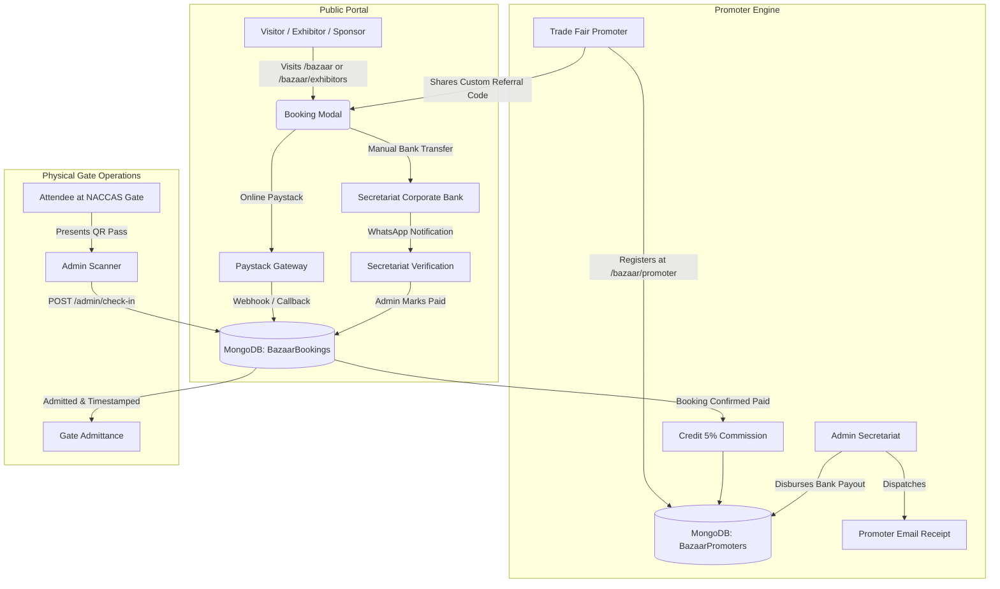
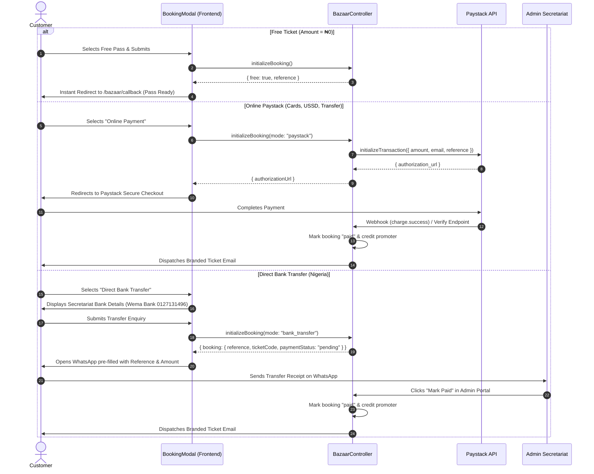
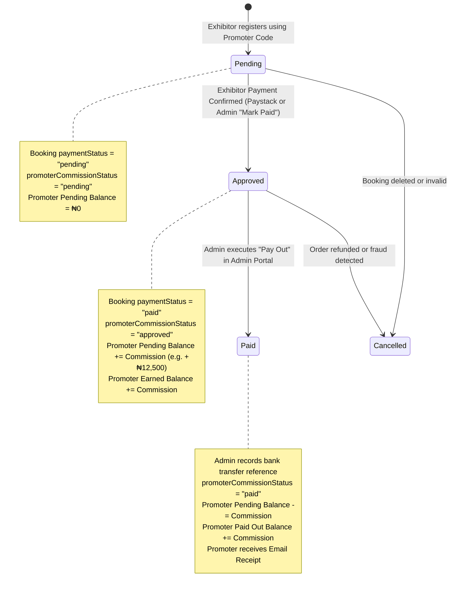

# GloTrade International Trade Fair 2026 — End-to-End System Architecture & Operating Guide

> **Document Version:** 1.0.0  
> **Classification:** Internal Technical Architecture & Operating Manual  
> **Platform:** GloTrade International E-Commerce & Trade Fair Portal  
> **Target Event:** GloTrade International Trade Fair 2026 (Abuja, FCT – Nigeria)  
> **Primary Venue:** Nigerian Army Conference Centre & Suites (NACCAS), Km 10 Expressway, Asokoro, Abuja  

---

## Table of Contents

1. [Executive Summary & System Architecture](#1-executive-summary--system-architecture)
2. [File System Manifest & Code Organization](#2-file-system-manifest--code-organization)
3. [Database Models & Data Schemas](#3-database-models--data-schemas)
   - [3.1 BazaarConfig (Event & System Controls)](#31-bazaarconfig-event--system-controls)
   - [3.2 BazaarBooking (Registrations, Passes & Audit Trail)](#32-bazaarbooking-registrations-passes--audit-trail)
   - [3.3 BazaarPromoter (Affiliate Partners & Financial Ledgers)](#33-bazaarpromoter-affiliate-partners--financial-ledgers)
4. [Public Attendee & Exhibitor Lifecycle](#4-public-attendee--exhibitor-lifecycle)
   - [4.1 Packages & Tier Architecture](#41-packages--tier-architecture)
   - [4.2 Registration Initialization Flow](#42-registration-initialization-flow)
   - [4.3 Dual Payment Gateway Engine (Paystack vs Manual Bank Transfer)](#43-dual-payment-gateway-engine-paystack-vs-manual-bank-transfer)
   - [4.4 Ticket Code & QR Pass Generation](#44-ticket-code--qr-pass-generation)
   - [4.5 Automated Email Delivery Engine](#45-automated-email-delivery-engine)
5. [The Trade Fair Promoter & Commission Subsystem](#5-the-trade-fair-promoter--commission-subsystem)
   - [5.1 Promoter Onboarding & PIN Security](#51-promoter-onboarding--pin-security)
   - [5.2 Referral Attribution & Commission Calculation](#52-referral-attribution--commission-calculation)
   - [5.3 Commission Lifecycle & State Machine](#53-commission-lifecycle--state-machine)
   - [5.4 Account Suspension & Reactivation Security](#54-account-suspension--reactivation-security)
   - [5.5 Promoter Payout Processing & Email Receipts](#55-promoter-payout-processing--email-receipts)
6. [Manager Audit Trail & Blame Log Engine](#6-manager-audit-trail--blame-log-engine)
   - [6.1 Actor Extraction & Identity Capture](#61-actor-extraction--identity-capture)
   - [6.2 Audit Log Event Types](#62-audit-log-event-types)
   - [6.3 Super Administrator Deletion Controls](#63-super-administrator-deletion-controls)
7. [Physical Gate Accreditation & QR Check-In](#7-physical-gate-accreditation--qr-check-in)
8. [Admin Operations Management Portal (`/admin/trade-fair`)](#8-admin-operations-management-portal-admintrade-fair)
   - [8.1 Seasonal Feature Flags & Kill Switches](#81-seasonal-feature-flags--kill-switches)
   - [8.2 Secretariat Bank Account Settings](#82-secretariat-bank-account-settings)
   - [8.3 Real-Time Global KPIs & Metrics](#83-real-time-global-kpis--metrics)
   - [8.4 Manual Booking Creation by Secretariat](#84-manual-booking-creation-by-secretariat)
   - [8.5 Ticket Confirmation Resender](#85-ticket-confirmation-resender)
9. [Complete API Reference Catalog](#9-complete-api-reference-catalog)
10. [Troubleshooting & Frequently Asked Questions (FAQ)](#10-troubleshooting--frequently-asked-questions-faq)

---

## 1. Executive Summary & System Architecture

The **GloTrade International Trade Fair System** (internally designated as the **Bazaar Engine**) is a high-availability, multi-tenant event management, ticketing, exhibitor allocation, affiliate commission, and physical accreditation platform built natively into the GloTrade e-commerce ecosystem.



### Core Technologies
- **Frontend:** Next.js 14 (React, App Router, TypeScript, TailwindCSS, Lucide Icons, Canvas QR Code).
- **Backend API:** Node.js, Express, TypeScript, Mongoose ORM.
- **Database:** MongoDB Atlas (Indexed collections: `bazaarbookings`, `bazaarpromoters`, `bazaarconfigs`).
- **Payment Infrastructure:** Paystack Gateway (Card, Bank Transfer, USSD) + Manual Bank Transfer verification flow.
- **Email Infrastructure:** Unified `EmailService` supporting AWS SES, SendGrid, and SMTP with automatic responsive HTML brand templating.

---

## 2. File System Manifest & Code Organization

```
glotrade_ecom/
├── apps/
│   ├── api/
│   │   └── src/
│   │       ├── controllers/
│   │       │   └── bazaar.controller.ts      # Core business logic: bookings, promoters, audit trail, payouts
│   │       ├── models/
│   │       │   ├── BazaarBooking.ts          # Ticket & stall reservation model with audit blame logs
│   │       │   ├── BazaarConfig.ts           # Seasonal switches, bank details, event metadata
│   │       │   └── BazaarPromoter.ts         # Promoter profiles, PIN hash, stats, payout history
│   │       ├── routes/
│   │       │   ├── bazaar.routes.ts          # Public, promoter, and manager API routes
│   │       │   └── payment.routes.ts         # Paystack webhook & callback verification
│   │       └── services/
│   │           └── EmailService.ts           # Branded Trade Fair tickets & payout receipts
│   │
│   └── web/
│       └── src/
│           ├── app/
│           │   ├── admin/
│           │   │   └── trade-fair/
│           │   │       └── page.tsx          # Full Secretariat Admin Management Portal
│           │   ├── bazaar/
│           │   │   ├── page.tsx              # Public Trade Fair Landing Page
│           │   │   ├── callback/
│           │   │   │   └── page.tsx          # Post-payment pass download & confirmation page
│           │   │   ├── exhibitors/
│           │   │   │   └── page.tsx          # Exhibitor stall tiers, rates, and application
│           │   │   └── promoter/
│           │   │       └── page.tsx          # Dedicated Promoter Registration & Dashboard
│           │   └── trade-fair/
│           │       └── exhibitors/
│           │           └── page.tsx          # Vanity redirect route for promoter referral links
│           └── components/
│               └── bazaar/
│                   ├── BookingModal.tsx      # Interactive registration modal (Tickets, Stalls, Sponsors)
│                   └── TicketDownload.tsx    # Digital pass renderer with QR code download
```

---

## 3. Database Models & Data Schemas

### 3.1 BazaarConfig (Event & System Controls)
**Collection:** `bazaarconfigs`  
Stores global operational flags, live event metadata, and secretariat financial settings.

| Field | Type | Default | Description |
|---|---|---|---|
| `isPortalActive` | `Boolean` | `true` | Master kill switch for the entire trade fair portal. |
| `ticketSalesActive` | `Boolean` | `true` | Toggles public visitor ticket issuance. |
| `exhibitorApplicationsActive` | `Boolean` | `true` | Toggles commercial exhibitor stall bookings. |
| `sponsorshipActive` | `Boolean` | `true` | Toggles sponsorship package applications. |
| `promoterProgramActive` | `Boolean` | `true` | Toggles affiliate promoter registrations and referral links. |
| `promoterCommissionPercent` | `Number` | `5` | Platform-wide default promoter commission rate (5%). |
| `inactiveMessage` | `String` | `"GloTrade..."` | Banner message shown when seasonal controls pause registration. |
| `eventTitle` | `String` | `"GloTrade..."` | Official event branding name. |
| `eventDateLabel` | `String` | `"1st – 5th Dec 2026"` | Public date display. |
| `eventVenue` | `String` | `"NACCAS, Abuja"` | Physical event address. |
| `bankName` | `String` | `"Wema Bank"` | Secretariat recipient bank name for manual transfers. |
| `bankAccountName` | `String` | `"GloTrade..."` | Secretariat recipient account name. |
| `bankAccountNumber` | `String` | `"0127131496"` | Secretariat recipient account number. |
| `whatsappNumber` | `String` | `"2347044600924"` | Official secretariat liaison WhatsApp contact. |
| `email` | `String` | `"tradefair@..."` | Official secretariat support email. |

---

### 3.2 BazaarBooking (Registrations, Passes & Audit Trail)
**Collection:** `bazaarbookings`  
The core transaction entity for every attendee, exhibitor, and sponsor.

| Field | Type | Description |
|---|---|---|
| `reference` | `String (Indexed)` | Unique booking reference (`BZ-TK-...`, `BZ-EX-...`, `BZ-SP-...`). |
| `ticketCode` | `String (Indexed)` | Unique human-readable gate pass code (`TF-TK-XXXXXX`). |
| `type` | `String` | `"ticket"` \| `"exhibitor"` \| `"sponsorship"` \| `"contact"`. |
| `packageId` | `String` | Identifier of the booked package (e.g. `stall-me`, `tier-small`). |
| `packageName` | `String` | Full display name (e.g. `Small Scale Enterprise (SSE)`). |
| `amount` | `Number` | Total monetary value in NGN (0 for free visitor passes). |
| `customerName` | `String` | Delegate / Primary contact full name. |
| `customerEmail` | `String` | Contact email address (ticket recipient). |
| `customerPhone` | `String` | Contact phone number. |
| `businessName` | `String?` | Company or organization name (for commercial stalls/sponsors). |
| `notes` | `String?` | Special requests, transfer notes, or booth setup requirements. |
| `paymentStatus` | `String` | `"pending"` \| `"paid"` \| `"failed"`. |
| `checkInStatus` | `String` | `"pending"` \| `"checked_in"`. |
| `checkInTime` | `Date?` | Exact timestamp when admitted at physical venue gate. |
| `promoterCode` | `String?` | Partner referral code attached to this booking. |
| `promoterId` | `ObjectId?` | Foreign key referencing `BazaarPromoter`. |
| `promoterCommissionPercent` | `Number?` | Commission rate locked in at time of booking (e.g. 5%). |
| `promoterCommissionAmount` | `Number?` | Calculated commission in NGN (e.g. ₦12,500 for SSE). |
| `promoterCommissionStatus` | `String?` | `"pending"` \| `"approved"` \| `"paid"` \| `"cancelled"`. |
| `auditLogs` | `Array<Entry>` | Chronological blame trail of every administrative mutation. |
| `registeredBy` | `AdminActor?` | Details of manager who created manual record. |
| `paymentApprovedBy` | `AdminActor?` | Details of manager who approved payment status to `paid`. |
| `checkedInBy` | `AdminActor?` | Details of manager who scanned and admitted ticket at gate. |

---

### 3.3 BazaarPromoter (Affiliate Partners & Financial Ledgers)
**Collection:** `bazaarpromoters`  
Manages partner identities, payout bank credentials, referral tallies, and financial disbursement receipts.

```typescript
interface IBazaarPromoter {
  promoterCode: string;          // e.g. "TF-PROMO-3C64B0" (Unique, Indexed)
  name: string;                  // Full Name
  email: string;                 // Lowercase, Unique
  phone: string;                 // Phone number
  pinHash: string;               // Bcrypt hash of 4-8 digit security PIN
  bankDetails: {
    bankName: string;            // Nigerian Bank Name (e.g. "Access Bank")
    accountNumber: string;       // 10-digit NUBAN
    accountName: string;         // Verified Account Name
  };
  status: "active" | "suspended";// Status switch
  stats: {
    totalReferredExhibitors: number;
    paidExhibitors: number;
    totalBookingValue: number;
    totalCommissionEarned: number;
    totalCommissionPaid: number;
    pendingCommission: number;
  };
  payouts: Array<{
    amount: number;
    reference: string;           // Bank transaction reference / NIBSS Session ID
    paidAt: Date;
    paidBy?: { adminId: string; name: string; email: string };
    notes?: string;
  }>;
}
```

---

## 4. Public Attendee & Exhibitor Lifecycle

### 4.1 Packages & Tier Architecture

The Trade Fair offers tiered access across three distinct user categories:

#### 1. Public Visitor & Trade Buyer Passes
- **Free Public Day Pass:** Single-day entry pass for general visitors (₦0).
- **Free 5-Day Visitor Pass:** Full-event access accreditation (₦0).
- **Trade Buyer & B2B Pass:** Accelerated badge for verified wholesale sourcing buyers (₦0).
- **VIP Executive Accreditation:** VIP Lounge access and networking dinner accreditation (₦0 / ₦50,000 depending on season).

#### 2. Commercial Exhibitor Pavilions & Stalls
- **Micro Enterprise (ME):** ₦150,000 (or ₦30,000/day) — 7.5 sqm pavilion booth, 1 table, 1 chair, lighting, 30s documentary, certificate.
- **Small Scale Enterprise (SSE):** ₦250,000 (or ₦50,000/day) — 15 sqm pavilion booth, 1 table, 2 chairs, lighting, 1 min documentary, certificate.
- **Bronze Membership (BM):** ₦375,000 — 20 sqm booth, premium pavilion position, directory branding.
- **Silver Membership (SM):** ₦500,000 — 25 sqm double booth, executive lounge, prime corridor positioning.
- **Gold Membership (GM):** ₦750,000 — 35 sqm corner island booth, dedicated presentation slot.
- **Platinum Membership (PM):** ₦1,000,000 — 50 sqm flagship centerpiece booth, keynote recognition.
- **Country Pavilions:** Custom bilateral mission reservations for international diplomatic trade attachés.

#### 3. Corporate Sponsorship Packages
- **Gold Sponsorship (₦500,000):** Banner placement, VIP table, program recognition.
- **Headline Sponsorship (₦1,500,000):** Stage branding, main screen TV commercial loops, ceremonial opening address.

---

### 4.2 Registration Initialization Flow

When a user submits the booking modal:
1. **Frontend Validation:** Verifies name, email, phone, and optional promoter referral code.
2. **Endpoint:** `POST /api/v1/bazaar/initialize-booking`
3. **Reference Generation:**
   - Ticket prefix: `BZ-TK-...`
   - Exhibitor prefix: `BZ-EX-...`
   - Sponsor prefix: `BZ-SP-...`
   - Ticket Code: `TF-TK-XXXXXX` (6 alphanumeric characters)
4. **Promoter Code Resolution:** If an active promoter code is supplied on an exhibitor booking:
   - Verifies the promoter exists and `status === "active"`.
   - Attaches `promoterId`, `promoterCode`, and calculates `promoterCommissionAmount = (amount * 5) / 100`.
   - Sets `promoterCommissionStatus = "pending"`.
   - Increments `promoter.stats.totalReferredExhibitors` and `totalBookingValue`.

---

### 4.3 Dual Payment Gateway Engine (Paystack vs Manual Bank Transfer)



---

### 4.4 Ticket Code & QR Pass Generation

Every confirmed registration generates a unique **Alphanumeric Ticket Code** (`TF-TK-XXXXXX`) and a **Cryptographic QR Payload**.

The QR payload contains:
```json
{
  "ticketCode": "TF-TK-3C64B0",
  "ref": "BZ-EX-1790732749931-317E",
  "name": "Samuel Okon",
  "pkg": "Micro Enterprise (ME)",
  "status": "paid",
  "event": "tradefair_2026"
}
```

The frontend uses `qrcode` Canvas rendering in [`TicketDownload.tsx`](file:///Users/harz/Documents/backUps/glotrade_ecom/apps/web/src/components/bazaar/TicketDownload.tsx) to generate downloadable, high-resolution admission badge PNG images and printable PDF passes.

---

### 4.5 Automated Email Delivery Engine

When payment is confirmed (either via Paystack webhook or Admin Mark Paid):
1. **Trigger:** `EmailService.sendBazaarConfirmationEmail(booking)`
2. **Template Layout:** Official GloTrade header, event details, venue address, customer information, ticket badge card, QR code rendering, and an *"Access Digital Admission Pass"* button leading directly to `/bazaar/callback?reference=BZ-...`.

---

## 5. The Trade Fair Promoter & Commission Subsystem

The Trade Fair Promoter Program empowers field promoters, social influencers, and B2B agents to refer exhibitors and earn cash commissions.

### 5.1 Promoter Onboarding & PIN Security
- **Portal:** `/bazaar/promoter`
- **Registration Form:** Full Name, Email, Phone, Bank Name, 10-digit Account Number, Account Name, and a 4-8 digit Security PIN.
- **Passwordless Security:** Promoters do not need passwords. They log in securely using their **Email / Phone + PIN**.
- **PIN Storage:** Encrypted using `bcrypt.hash(pin, 10)` as `pinHash`.
- **Referral Code Generation:** Unique 6-character hex code prefixed with `TF-PROMO-` (e.g. `TF-PROMO-3C64B0`).
- **Referral Link:** Direct link: `https://glotrade.online/trade-fair/exhibitors?ref=TF-PROMO-3C64B0` (auto-populates the booking modal).

---

### 5.2 Referral Attribution & Commission Calculation

- **Commission Rate:** Configurable platform-wide default of **5%** (stored in `BazaarConfig.promoterCommissionPercent`).
- **Qualifying Tiers:** Commercial exhibitor stalls (Micro Enterprise, Small Scale, Bronze, Silver, Gold, Platinum).
- **Calculation Formula:**
  $$\text{Commission Amount} = \text{round}\left(\frac{\text{Stall Booking Amount} \times 5}{100}\right)$$

#### Example Earnings:
| Package Tier | Stall Price | Commission (5%) |
|---|---|---|
| Micro Enterprise (ME) | ₦150,000 | **₦7,500** |
| Small Scale Enterprise (SSE) | ₦250,000 | **₦12,500** |
| Bronze Membership (BM) | ₦375,000 | **₦18,750** |
| Silver Membership (SM) | ₦500,000 | **₦25,000** |
| Gold Membership (GM) | ₦750,000 | **₦37,500** |
| Platinum Membership (PM) | ₦1,000,000 | **₦50,000** |

---

### 5.3 Commission Lifecycle & State Machine



---

### 5.4 Account Suspension & Reactivation Security

To protect against referral manipulation or policy violations, the platform features a strict **Promoter Suspension Engine**:

1. **Admin Toggle:** Located in the Promoters & Commissions table in `/admin/trade-fair`. Clicking **Suspend** or **Activate** triggers `PATCH /api/v1/bazaar/admin/promoters/:id/status`.
2. **Login Blocking:** Suspended promoters attempting to log in receive `403 Forbidden` (`"Your promoter account has been suspended by the secretariat."`).
3. **Referral Code Blocking:** Suspended promoter codes entered on the booking modal fail validation (`"This promoter code is currently inactive."`).
4. **Active Session Shielding:** If a suspended promoter visits their dashboard with an active JWT, `GET /api/v1/bazaar/promoters/me` returns `403` with `{ suspended: true }`.
5. **Dashboard Banner Alert:** The promoter frontend renders a prominent red **"Account Suspended"** alert banner displaying the secretariat contact instructions and suppresses referral operations.

---

### 5.5 Promoter Payout Processing & Email Receipts

When a promoter accumulates approved commissions:

1. **Trigger:** The Admin navigates to `/admin/trade-fair` → **Promoters & Commissions**.
2. **Action Button:** A green **"Pay Out"** button is rendered for any promoter with `pendingCommission > 0`. (A gray **"Payouts"** button is available for ₦0 balance to review historical receipts).
3. **Payout Modal Display:**
   - Displays the promoter's registered Nigerian Bank Name, Account Number (with 1-click **Copy** button), and Account Name.
   - Financial overview: Pending Payout, Total Paid, and Total Earned.
   - Payout Amount input (pre-filled with pending balance, with a *"Pay Full Balance"* shortcut).
   - Mandatory **Transfer Reference / Receipt Number** field (NIBSS Session ID / Bank Ref) for audit compliance.
   - Optional Admin Notes field.
4. **Backend Ledger Update (`POST /api/v1/bazaar/admin/promoters/:id/payout`):**
   - Appends a permanent payout record to `promoter.payouts`.
   - Decrements `promoter.stats.pendingCommission` by the paid amount.
   - Increments `promoter.stats.totalCommissionPaid`.
   - Marks all associated approved bookings as `paid`.
5. **Automated Branded Email Receipt:**
   - An email receipt is immediately dispatched to `promoter.email`.
   - Contains: Amount Paid in ₦, Beneficiary Bank Details, Transaction Reference, Date, Total Paid to Date, Remaining Pending Balance, and a direct CTA link to their promoter portal.

---

## 6. Manager Audit Trail & Blame Log Engine

The platform enforces full managerial accountability across all administrative mutations through a **Blame Trail Engine**.

### 6.1 Actor Extraction & Identity Capture

Every administrative request passes through `requireAuth` and `requireBazaarManager`. The controller executes [`extractAdminActor(req)`](file:///Users/harz/Documents/backUps/glotrade_ecom/apps/api/src/controllers/bazaar.controller.ts#L90-L108) which extracts:
- `adminId`: Mongo ID of the authenticated user.
- `name`: Full display name of the manager.
- `email`: Authenticated email address.
- `role`: Admin / Manager authorization role.

---

### 6.2 Audit Log Event Types

Every booking retains an immutable `auditLogs` array documenting all lifecycle events:

| Action Code | Trigger Event | Log Details Recorded |
|---|---|---|
| `MANUAL_REGISTRATION` | Admin created registration manually | Package name, Amount, Initial payment status |
| `PAYMENT_MARKED_PAID` | Admin flipped payment status to `paid` | Previous status, new status (`PAID`), Timestamp |
| `PAYMENT_STATUS_CHANGE` | Admin reset status to `pending` / `failed` | Old status, new status, Timestamp |
| `GATE_CHECK_IN` | QR code scanned or manual gate admittance | Admitted time, gate officer identity |
| `CHECK_IN_STATUS_CHANGE` | Check-in status reset | Reversal details |
| `NOTES_UPDATED` | Special requests or audit notes edited | Content update note |
| `RESEND_CONFIRMATION_EMAIL` | Admin resent ticket email | Target recipient email address |

### Viewing the Audit Trail
In `/admin/trade-fair`:
1. Click **Inspect** on any booking row.
2. Scroll to the **"Manager Audit & Action Trail (Blame Log)"** card.
3. Every historical action displays the manager's name, email, exact timestamp, and action description.

---

### 6.3 Super Administrator Deletion Controls

To prevent accidental data loss or unauthorized record destruction:
- Deleting single registrations (`DELETE /api/v1/bazaar/admin/bookings/:id`) and bulk deletion (`POST /api/v1/bazaar/admin/bookings/bulk-delete`) are strictly gated by the **`requireSuperAdmin`** middleware.
- Regular Bazaar Managers cannot delete registration records.
- Deletion actions prompt a double-confirmation modal warning that ticket passes will be permanently invalidated.

---

## 7. Physical Gate Accreditation & QR Check-In

During the physical trade fair at NACCAS (Dec 1-5, 2026):

1. **Attendee Arrival:** The attendee presents their digital pass (smartphone) or printed PDF.
2. **Scanner Activation:** The gate officer opens `/admin/trade-fair` on a tablet or mobile device and clicks **"Scan QR Ticket"**.
3. **Camera Recognition:** The integrated `QRCodeScanner` component captures the ticket code (`TF-TK-XXXXXX`).
4. **Validation Endpoint (`POST /api/v1/bazaar/admin/check-in`):**
   - **Scenario A (Success):** If payment is `paid` and `checkInStatus === "pending"`, the system admits the attendee, sets `checkInStatus = "checked_in"`, records `checkInTime = new Date()`, tags `checkedInBy` with the gate officer's details, and logs `GATE_CHECK_IN`.
   - **Scenario B (Already Admitted):** Returns `400 Bad Request` with `"Ticket already checked in at [Timestamp] by [Officer Name]"`, preventing pass reuse or gate duplicate fraud.
   - **Scenario C (Unpaid):** Returns `400 Bad Request` with `"Booking payment is pending. Please collect payment before admitting."`

---

## 8. Admin Operations Management Portal (`/admin/trade-fair`)

The Secretariat Admin Portal provides centralized operational control:

### 8.1 Seasonal Feature Flags & Kill Switches
Admins can toggle the trade fair seasons in real time:
- **Event Portal Active:** Turns the public site on/off. When off, visitors see a custom suspension banner.
- **Ticket Sales Active:** Temporarily pauses public passes.
- **Exhibitor Applications Active:** Opens or closes stall bookings.
- **Sponsorship Applications Active:** Toggles partnership intake.

### 8.2 Secretariat Bank Account Settings
Admins can dynamically update the recipient Bank Name, Account Number, and Account Name. Once saved, these updates instantly reflect across all public booking modals without redeploying code.

### 8.3 Real-Time Global KPIs & Metrics
Top metrics display:
- **Total Registrations** (All attendees, exhibitors, sponsors).
- **Total Revenue (NGN)** (All verified paid transactions).
- **Exhibitor Stalls Booked** (Paid vs Pending breakdown).
- **Physical Gate Check-Ins** (Admitted delegate count).
- **Active Promoters & Commissions Paid** (Total commission liability vs settled).

### 8.4 Manual Booking Creation by Secretariat
For walk-in delegates, government dignitaries, or telephone VIP allocations:
- Click **"+ Manual Registration"**.
- Select preset tier or enter custom amount.
- Set payment status to `paid` (instantly dispatches ticket email) or `pending`.
- Manager identity is permanently tagged as the creator.

### 8.5 Ticket Confirmation Resender
If a customer claims they did not receive their email:
- Click **Inspect** → **"Resend Ticket Confirmation Email"**.
- The system re-dispatches the branded ticket pass to the customer's email and adds an entry to the Audit Blame Log.

---

## 9. Complete API Reference Catalog

### Public Routes (`/api/v1/bazaar`)
| Method | Endpoint | Description | Auth Required |
|---|---|---|---|
| `GET` | `/config` | Returns public event title, flags, venue, and bank details | No |
| `POST` | `/initialize-booking` | Creates ticket / stall booking and resolves Paystack URL | No |
| `GET` | `/verify-payment/:reference?` | Verifies Paystack transaction and marks booking paid | No |
| `POST` | `/contact` | Submits general trade fair or country pavilion enquiry | No |
| `POST` | `/promoters/register` | Registers new promoter with PIN and Nigerian bank account | No |
| `POST` | `/promoters/login` | Authenticates promoter via Email/Phone + PIN; returns JWT | No |
| `GET` | `/promoters/me` | Fetches authenticated promoter dashboard and referrals | Promoter JWT |
| `GET` | `/promoters/validate/:code` | Validates partner referral code for booking forms | No |

### Secretariat Admin Routes (`/api/v1/bazaar/admin`)
| Method | Endpoint | Description | Auth Required |
|---|---|---|---|
| `GET` | `/stats` | Aggregated financial, registration, and promoter KPIs | Manager / Admin |
| `PUT` | `/config` | Updates seasonal flags, message, and bank accounts | Manager / Admin |
| `GET` | `/bookings` | Paginated booking list with search, status, and type filter | Manager / Admin |
| `POST` | `/bookings/manual` | Creates manual registration with Manager Blame Tagging | Manager / Admin |
| `PATCH` | `/bookings/:id` | Updates payment, check-in, or audit notes | Manager / Admin |
| `POST` | `/bookings/:id/resend-email` | Resends ticket confirmation email with audit log | Manager / Admin |
| `POST` | `/check-in` | Validates and checks in ticket code at physical gate | Manager / Admin |
| `GET` | `/promoters` | Lists promoters, financial tallies, and search | Manager / Admin |
| `PATCH` | `/promoters/:id/status` | Suspends or reactivates a promoter account | Manager / Admin |
| `POST` | `/promoters/:id/payout` | Records bank payout, updates ledgers, sends receipt email | Manager / Admin |
| `DELETE` | `/bookings/:id` | Permanently deletes a single registration | **Super Admin Only** |
| `POST` | `/bookings/bulk-delete` | Permanently deletes multiple registrations | **Super Admin Only** |

---

## 10. Troubleshooting & Frequently Asked Questions (FAQ)

#### Q1: An exhibitor booked a stall using a promoter code, but the promoter's Pending Commission is still ₦0. Why?
**Answer:** The exhibitor's booking is still in **`pending`** payment status (e.g. they submitted a manual bank transfer enquiry or have not completed Paystack checkout). Promoter commissions are only credited once the exhibitor's payment is verified and marked as **`paid`**. Once the admin clicks **Mark Paid**, the commission is credited immediately.

#### Q2: How does the admin know which bank account to transfer commission payouts to?
**Answer:** In `/admin/trade-fair` under **Promoters & Commissions**, clicking **Pay Out** opens the **Payout Modal**. The modal displays the promoter's registered Nigerian Bank Name, Account Number (with a 1-click **Copy** button), and verified Account Name.

#### Q3: Does the promoter receive proof when a commission payout is recorded?
**Answer:** Yes. As soon as the admin submits the payout reference, [`EmailService`](file:///Users/harz/Documents/backUps/glotrade_ecom/apps/api/src/services/EmailService.ts) automatically sends a branded receipt email to the promoter detailing the amount paid, bank account, transaction reference, date, total commission paid to date, and remaining balance.

#### Q4: What happens if an attendee's QR code does not scan at the venue gate?
**Answer:** The gate officer can manually type the 6-character Ticket Code (printed directly below the QR code, e.g. `TF-TK-3C64B0`) into the **Gate Check-In** input box in `/admin/trade-fair` and click **Admit Guest**.

#### Q5: Can a regular Bazaar Manager delete registrations or wipe audit logs?
**Answer:** No. Single and bulk deletion routes are strictly protected by `requireSuperAdmin`. Audit logs are append-only and cannot be altered or deleted through the interface.

---

*(End of Guide — Maintained by the GloTrade Technical Secretariat)*
